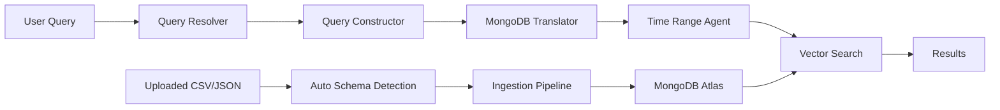

# 🔎 SmartFilteringRAG — Intelligent Metadata-Aware Vector Search

> **Natural language in → Smart filtered results out.**  
> Ask questions like *"recommend a latest anime movie"* and the system automatically builds MongoDB filters, resolves time ranges, and runs vector search — all in one pipeline.

---

## 📋 Table of Contents

- [1. Problem](#1-problem)
- [2. Proposed Solution](#2-proposed-solution)
- [3. How It Works — Full Pipeline](#3-how-it-works--full-pipeline)
- [4. Implementation](#4-implementation)
- [5. Concepts Used](#5-concepts-used)
- [6. Final Results](#6-final-results)
- [7. How to Run This Project](#7-how-to-run-this-project)

---

## 1. Problem

### The Limitation of Plain Vector Search

Traditional vector search (semantic search) works great for finding **conceptually similar** documents. But it completely ignores **structured constraints** that users naturally express:

| User Query | What They Mean | What Plain Vector Search Does |
|-----------|----------------|-------------------------------|
| *"anime movies released before 2010"* | Genre = anime **AND** date < 2010 | Searches for semantically similar text — might return a 2023 action movie |
| *"highest rated thriller"* | Genre = thriller, sort by rating | Returns any movie about thrillers, regardless of actual rating |
| *"latest Apple electronics under $500"* | Brand = Apple, category = Electronics, price < 500 | Matches text similarity to "Apple electronics" — might return a $3000 laptop |

### The Core Issue

Users ask questions with **two types of intent mixed together**:

1. **Semantic intent** — *what* they're looking for (conceptual meaning)
2. **Structured constraints** — *filters* on specific fields (dates, categories, prices, ratings)

Plain vector search only handles #1. The structured constraints get lost.

### Follow-Up Queries Are Even Harder

Real users don't ask one-shot questions. They have **conversations**:

```
User: "Show me anime movies"          → Gets results
User: "What about before 1990?"       → Wants to KEEP anime filter, ADD date filter
User: "Directed by Satoshi Kon?"      → Wants to KEEP anime + date, ADD director filter
```

Without conversation memory, each query starts from scratch and loses all prior context.

---

## 2. Proposed Solution

**SmartFilteringRAG** solves this by adding an intelligent **pre-filtering layer** before vector search. The system:

1. **Understands** the user's natural language query using an LLM
2. **Extracts** structured metadata filters (genre, date, price, etc.)
3. **Resolves** time-based queries ("latest", "most recent", "oldest")
4. **Remembers** conversation context and carries filters forward
5. **Searches** with both metadata filters AND semantic similarity combined

### Key Innovation

Instead of choosing between *keyword search* and *vector search*, SmartFilteringRAG uses **both together**:

```
User Query → LLM extracts filters → MongoDB Atlas pre-filter → Vector search on filtered subset
```

This means you get the **precision of structured filtering** combined with the **recall of semantic search**.

---

## 3. How It Works — Full Pipeline

### High-Level Architecture

```
┌──────────────────────────────────────────────────────────────┐
│                    USER QUERY                                │
│            "recommend latest anime movie"                    │
└──────────────────────┬───────────────────────────────────────┘
                       │
                       ▼
┌──────────────────────────────────────────────────────────────┐
│  STEP 0: QUERY RESOLVER (Multi-Turn Memory)                  │
│  • Is this a follow-up or fresh query?                       │
│  • If follow-up: rewrite into self-contained query           │
│  • Carries forward filters from previous turns               │
└──────────────────────┬───────────────────────────────────────┘
                       │
                       ▼
┌──────────────────────────────────────────────────────────────┐
│  STEP 1: QUERY CONSTRUCTOR (Metadata Filter Generation)      │
│  • LLM analyzes the query against known metadata schema      │
│  • Generates structured filter: {genre: {$in: ["anime"]}}   │
│  • Rewrites query to remove filter parts: "recommend movie"  │
└──────────────────────┬───────────────────────────────────────┘
                       │
                       ▼
┌──────────────────────────────────────────────────────────────┐
│  STEP 2: TIME RANGE CONSTRUCTOR                              │
│  • Detects temporal keywords: "latest", "most recent", etc.  │
│  • Queries MongoDB to find actual date boundaries            │
│  • Adds date filter: {release_date: {$gte: "2023-01-01"}}   │
│  • Merges with Step 1 filters via $and                       │
└──────────────────────┬───────────────────────────────────────┘
                       │
                       ▼
┌──────────────────────────────────────────────────────────────┐
│  STEP 3: VECTOR SEARCH (MongoDB Atlas)                       │
│  • Applies merged pre-filter to narrow candidate set         │
│  • Runs kNN vector search on filtered documents only         │
│  • Returns top-k semantically similar results                │
└──────────────────────┬───────────────────────────────────────┘
                       │
                       ▼
┌──────────────────────────────────────────────────────────────┐
│  RESULTS with full transparency                              │
│  • Retrieved documents displayed as cards                    │
│  • Filter panel shows what the system understood             │
│  • Latency breakdown for each step                           │
└──────────────────────────────────────────────────────────────┘
```

### Step-by-Step Walkthrough

#### Step 0 — Query Resolution (Conversation Memory)

When the user sends a query, the system first checks if it's a **follow-up** to a previous question:

- **Fresh query** (e.g., "show me anime movies") → runs the full pipeline normally
- **Follow-up with keep_all** (e.g., "show me more") → skips filter generation, reuses previous filters
- **Follow-up with modify** (e.g., "what about before 1990?") → rewrites to "anime movies released before 1990" and runs the pipeline with this self-contained query

The resolver uses an LLM with **6 few-shot examples** covering common follow-up patterns. It outputs:
- `is_followup`: boolean
- `filter_action`: "fresh" | "keep_all" | "modify"
- `resolved_query`: the rewritten self-contained query

#### Step 1 — Query Constructor (Metadata Filter Generation)

The Query Constructor uses LangChain's `load_query_constructor_runnable` which:

1. Takes the **metadata schema** (field names, types, descriptions) and the query
2. Generates a **StructuredQuery** object containing a filter expression and a rewritten query
3. The **MongoDBAtlasTranslator** converts this into a MongoDB-compatible `$match` filter
4. `enforce_constraints()` validates the filter structure

**Example:**

```
Input:  "recommend an anime movie with rating above 8"
Output: 
  filter: {"$and": [{"genre": {"$in": ["anime"]}}, {"rating": {"$gt": 8}}]}
  query:  "recommend a movie"
```

#### Step 2 — Time Range Constructor

For temporal queries ("latest", "most recent", "earliest"), the system:

1. Creates a **tool-calling agent** with access to MongoDB
2. The agent **queries the collection** to find actual min/max dates matching the existing filter
3. Generates an additional date-range filter
4. Merges it with Step 1's filter using `$and`

**Example:**

```
Input:  filter={genre: anime}, query="latest anime movie"
Agent:  Queries MongoDB → finds max(release_date) for anime = "2006-11-25"
Output: time_filter={release_date: {$gte: "2006-11-25"}}
Merged: {$and: [{genre: anime}, {release_date: {$gte: "2006-11-25"}}]}
```

#### Step 3 — Vector Search

Using **MongoDB Atlas Vector Search**:

1. The `pre_filter` narrows the candidate set (e.g., only anime movies after 2006)
2. kNN search runs on the filtered subset using cosine similarity
3. Top-k documents are returned

This is the key advantage — instead of searching across ALL documents, vector search runs on a **pre-filtered subset**, giving much more relevant results.

---

## 4. Implementation

### Project Structure

```
SmartFilteringRAG/
├── app.py                          # 🎨 Streamlit UI (main entry point)
├── config/
│   └── config.yaml                 # ⚙️ Model, database, and embedding config
├── rag/
│   ├── __init__.py
│   ├── auto_metadata.py            # 🧬 LLM-based schema extraction for uploaded datasets
│   ├── config_loader.py            # 📄 YAML config loader
│   ├── ingest.py                   # 📥 Dynamic dataset ingestion pipeline
│   ├── initialize_mongo_collection.py  # 🏗️ Seeds DB with sample movie data
│   ├── main.py                     # 🔧 CLI-based RAG pipeline (original)
│   ├── metadata_filter.py          # 🧠 Core: Query Constructor + Time Range Filter
│   ├── prompts.py                  # 📝 LLM prompt templates and examples
│   ├── query_resolver.py           # 🔗 Multi-turn conversation resolver
│   ├── tools.py                    # 🔨 MongoDB aggregation executor tools
│   └── utils/
│       ├── mongodb_helper.py       # 🔌 MongoDB connection + index creation
│       └── prepare_test_data.py    # 🎬 Sample movie dataset + metadata schema
├── .env                            # 🔑 API keys and MongoDB URI
├── requirements.txt                # 📦 Python dependencies
├── sample_products.csv             # 🛍️ Sample e-commerce dataset for testing upload
└── README.md                       # 📖 This file
```

### Key Files Explained

| File | Role |
|------|------|
| `metadata_filter.py` | **Core pipeline logic.** Contains the `MetadataFilter` class that orchestrates Query Constructor → Translator → Time Range Filter |
| `query_resolver.py` | **Conversation memory.** Detects follow-up queries and rewrites them into self-contained versions |
| `auto_metadata.py` | **Schema extraction.** Sends sample data to the LLM and gets back field types, descriptions, and content column identification |
| `ingest.py` | **Dynamic ingestion.** Converts any DataFrame into embedded documents in MongoDB with proper vector search index |
| `app.py` | **UI layer.** Premium dark-themed Streamlit app with glassmorphism design, filter transparency, latency metrics, file upload, and chat interface |
| `prompts.py` | **Prompt engineering.** Contains schema prompts, few-shot examples, and system prompts for the LLM |
| `tools.py` | **MongoDB tools.** Provides `QueryExecutorMongoDBTool` that the time-range agent uses to query the database |

### Data Flow



---

## 5. Concepts Used

### 5.1 RAG (Retrieval-Augmented Generation)

RAG combines **retrieval** (finding relevant documents) with **generation** (using an LLM to answer questions). SmartFilteringRAG enhances the retrieval step with metadata-aware pre-filtering.

### 5.2 Vector Embeddings

Text is converted into **high-dimensional vectors** (numbers) using the `sentence-transformers/all-MiniLM-L6-v2` model. Similar texts produce similar vectors, enabling semantic search.

- **384 dimensions** per embedding
- **Cosine similarity** for comparison
- **Runs locally** — no API calls needed for embeddings

### 5.3 MongoDB Atlas Vector Search

MongoDB Atlas provides **knnVector** index type that enables:

- **Pre-filtering**: Apply structured `$match` filters BEFORE vector search
- **kNN search**: Find k-nearest neighbors in vector space
- Combined: narrowed search = faster + more relevant results

### 5.4 LangChain Query Constructor

LangChain's `load_query_constructor_runnable` is a chain that:

1. Takes a **metadata schema** (field names, types, allowed values)
2. Takes a **user query** in natural language
3. Returns a **StructuredQuery** with `filter` and `query` components

The filter is then translated to MongoDB syntax using `MongoDBAtlasTranslator`.

### 5.5 Tool-Calling Agents

For time-range resolution, the system uses a **LangChain Agent** with:

- A custom tool (`QueryExecutorMongoDBTool`) that runs MongoDB aggregation pipelines
- The agent decides what MongoDB queries to run to find date boundaries
- This allows resolving "latest" → actual date values from the data

### 5.6 Multi-Turn Conversation Memory

The Query Resolver maintains conversation state:

- **Last 3 turns** of history (query + filters used)
- **Active filters** from the most recent successful query
- LLM classifies each new query as fresh/follow-up with 6 few-shot examples

### 5.7 Dynamic Schema Detection

For uploaded datasets, the LLM automatically:

- Identifies the **content column** (main text for semantic search)
- Classifies all other columns as **metadata fields** with proper types
- Maps types to Atlas index field types (`string → token`, `float → number`)

---

## 6. Final Results

### Features

| Feature | Description |
|---------|-------------|
| 🔎 **Smart Filtering** | Automatically extracts metadata filters from natural language queries |
| ⏰ **Time Range Resolution** | Handles "latest", "most recent", "earliest" using actual data boundaries |
| 🔗 **Conversation Memory** | Follow-up queries carry forward filters from previous turns |
| 📤 **Dataset Upload** | Upload any CSV/JSON → auto-detect schema → ingest → query |
| 🧬 **Auto Schema Detection** | LLM analyzes uploaded data and identifies field types automatically |
| 🎯 **Filter Transparency** | Expandable panel showing exactly what filters were generated at each step |
| ⚡ **Latency Breakdown** | Per-step timing: resolution, filter generation, time-range, retrieval |
| 🎨 **Premium UI** | Dark theme, glassmorphism cards, gradient accents, smooth animations |

### Example Queries

**With the default movie dataset:**

| Query | Filters Generated |
|-------|-------------------|
| "show me anime movies" | `{genre: {$in: ["anime"]}}` |
| "thriller rated above 8" | `{$and: [{genre: {$in: ["thriller"]}}, {rating: {$gt: 8}}]}` |
| "latest movie by Christopher Nolan" | `{director: "Christopher Nolan"}` + time-range filter |

**Multi-turn conversation:**

```
Turn 1: "anime movies"              → {genre: anime}
Turn 2: "directed by Satoshi Kon"   → rewrites to "anime movies by Satoshi Kon"
Turn 3: "show me more"              → reuses all filters, new vector results
Turn 4: "recommend a comedy"        → fresh query, all filters reset
```

**With a custom uploaded dataset (e.g., products):**

| Query | Filters Generated |
|-------|-------------------|
| "electronics under $500" | `{$and: [{category: "Electronics"}, {price: {$lt: 500}}]}` |
| "same but from Apple" | rewrites to "Apple electronics under $500" |

---

## 7. How to Run This Project

### Prerequisites

- **Python 3.11+**
- **MongoDB Atlas** account (free tier works)
- **Groq API key** (free at [console.groq.com](https://console.groq.com))

### Step 1 — Clone & Install

```bash
git clone https://github.com/your-username/SmartFilteringRAG.git
cd SmartFilteringRAG

pip install -r requirements.txt
```

### Step 2 — Configure Environment

Create a `.env` file in the project root:

```env
# MongoDB Atlas connection string
MONGO_URI=mongodb+srv://<username>:<password>@<cluster>.mongodb.net/?appName=Cluster0

# Groq API key (used as OpenAI-compatible endpoint)
OPEN_AI_API_KEY=gsk_your_groq_api_key_here

# Groq API base URL
OPEN_API_BASE=https://api.groq.com/openai/v1

# Optional — leave empty if not needed
OPEN_API_DEFAULT_HEADERS=
```

### Step 3 — Configure Model (Optional)

Edit `config/config.yaml` to change the LLM model:

```yaml
database_name: test-smart-filtering
collection_name: test-smart-filtering
vector_index_name: default
embedding_model_dimensions: 384
similarity: cosine
model: llama-3.3-70b-versatile          # Groq model name
embedding_model: sentence-transformers/all-MiniLM-L6-v2
```

### Step 4 — Initialize the Database

This seeds MongoDB with 5 sample movie documents and creates the vector search index:

```bash
python -m rag.initialize_mongo_collection
```

> **Note:** The embedding model (~90MB) will be downloaded on first run. The Atlas vector search index takes ~30 seconds to become active after creation.

### Step 5 — Launch the App

```bash
streamlit run app.py
```

Open your browser at `http://localhost:8501` and start querying!

### Step 6 — Try Custom Datasets (Optional)

1. Click **📤 Upload Your Dataset** in the sidebar
2. Upload a CSV or JSON file (try the included `sample_products.csv`)
3. Click **🔍 Detect Schema** — the LLM auto-detects field types
4. Review and edit the schema if needed
5. Click **✅ Confirm & Ingest**
6. Wait ~30 seconds for the index to activate
7. Query your dataset!

---

### Common Issues

| Issue | Fix |
|-------|-----|
| `ModuleNotFoundError: No module named 'rag'` | Use `python -m rag.initialize_mongo_collection` (not `python rag/...`) |
| `KeyError: 'MONGO_URI'` | Make sure `.env` file exists with `MONGO_URI` set |
| `Error 402: requires more credits` | Switch to a free model (Groq models are free) |
| `Path 'X' needs to be indexed as token` | Re-run `python -m rag.initialize_mongo_collection` to rebuild the index |
| `torchvision` warnings | Harmless — ignore them. They come from Streamlit's file watcher scanning the transformers library |

---

### Tech Stack

| Component | Technology |
|-----------|------------|
| **LLM** | Groq (Llama 3.3 70B) via OpenAI-compatible API |
| **Embeddings** | HuggingFace `all-MiniLM-L6-v2` (local, free) |
| **Vector Database** | MongoDB Atlas Vector Search |
| **Framework** | LangChain (Query Constructor, Agents, Translators) |
| **UI** | Streamlit with custom CSS (glassmorphism dark theme) |
| **Language** | Python 3.11+ |

---

<p align="center">
  Built with ❤️ using LangChain, MongoDB Atlas, and Streamlit
</p>
