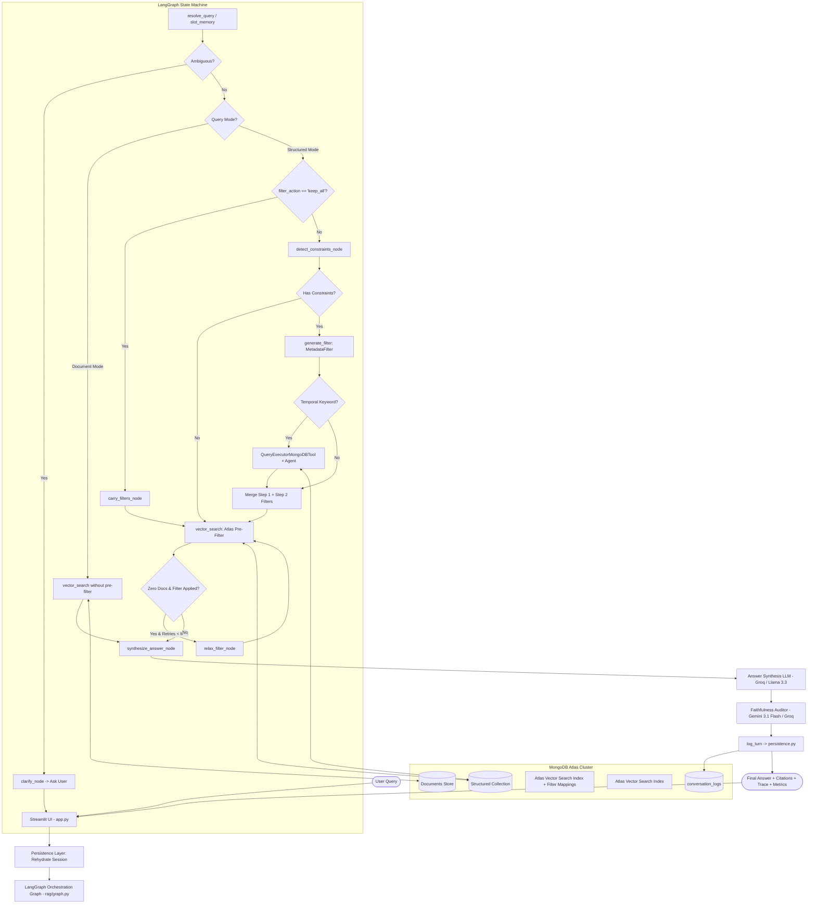

# 🔎 SmartSearch — Metadata-Aware Hybrid RAG & Vector Search Platform

[](https://www.python.org/downloads/)
[](https://github.com/langchain-ai/langgraph)
[](https://www.mongodb.com/products/platform/atlas-vector-search)
[](LICENSE)

> **Smart Filtering = Metadata Filtering + Vector Search > Pure Semantic Search for Structured Documents**  
> An intelligent search and Retrieval-Augmented Generation (RAG) system that bridges the gap between natural language semantic understanding and hard relational/database constraints. Ask queries like *"recommend a latest anime movie rated above 8"* or upload technical PDFs and ask questions with page-accurate citations and automated hallucination auditing.

---

## 📋 Table of Contents

- [1. Problem Statement](#1-problem-statement)
- [2. Project Overview](#2-project-overview)
- [3. Complete System Architecture](#3-complete-system-architecture)
- [4. CSV / JSON / Default Movies Pipeline](#4-csv--json--default-movies-pipeline)
- [5. PDF / DOCX RAG Pipeline](#5-pdf--docx-rag-pipeline)
- [6. Smart Filtering — Deep Dive](#6-smart-filtering--deep-dive)
- [7. Automatic Metadata Detection](#7-automatic-metadata-detection)
- [8. Multi-Turn Conversation & Slot Memory](#8-multi-turn-conversation--slot-memory)
- [9. Time-Based Query Resolution](#9-time-based-query-resolution)
- [10. MongoDB Atlas + Vector Search](#10-mongodb-atlas--vector-search)
- [11. Evaluation Suite](#11-evaluation-suite)
- [12. Detailed Project Structure](#12-detailed-project-structure)
- [13. File-to-File Relationships & Data Flow](#13-file-to-file-relationships--data-flow)
- [14. End-to-End Execution Walkthrough](#14-end-to-end-execution-walkthrough)
- [15. Technologies Used](#15-technologies-used)
- [16. Design Decisions & Trade-offs](#16-design-decisions--trade-offs)
- [17. Limitations & Known Issues](#17-limitations--known-issues)
- [18. Future Improvements](#18-future-improvements)
- [19. Setup & Running the Project](#19-setup--running-the-project)
- [20. 🎯 Interview Preparation Guide](#20--interview-preparation-guide)

---

## 1. Problem Statement

### The Core Problem: Why Pure Vector Search Fails on Structured Data

Modern semantic search relies on vector embeddings: high-dimensional mathematical representations of text where conceptual similarity corresponds to geometric proximity (cosine distance or dot product). Dense embeddings excel at answering fuzzy questions such as *"movies about space exploration"* or *"how to implement rate limiting"*.

However, real-world data is rarely purely unstructured text. Most production datasets consist of **structured documents** — records that pair descriptive natural language with concrete metadata attributes (dates, ratings, prices, categories, authors, IDs).

When users interact with search engines, they naturally combine two distinct modes of thinking:
1. **Semantic Intent:** The conceptual subject matter (e.g., *"dystopian thriller"*, *"lightweight laptop"*, *"distributed consensus"*).
2. **Structured Constraints:** Hard logical boundaries (e.g., `rating > 8.0`, `price < 500`, `release_date < 2010-01-01`, `category == 'Electronics'`).

```
                    ┌────────────────────────────────────────────────────────┐
                    │                      User Query:                       │
                    │ "Show me anime movies released before 2010 rated > 8"  │
                    └──────────────────────────┬─────────────────────────────┘
                                               │
               ┌───────────────────────────────┴───────────────────────────────┐
               ▼                                                               ▼
    ┌──────────────────────┐                                        ┌──────────────────────┐
    │   Semantic Intent    │                                        │Structured Constraints│
    │ "anime movies story" │                                        │ release_date < 2010  │
    │  (fuzzy similarity)  │                                        │     rating > 8.0     │
    └──────────────────────┘                                        └──────────────────────┘
```

### Concrete Failure Modes of Pure Semantic Search

| User Query | Intended Meaning | What Pure Vector Search Does | Real-World Failure |
| :--- | :--- | :--- | :--- |
| *"anime movies released before 2010"* | `genre == 'anime' AND release_date < 2010-01-01` | Computes cosine similarity between query and movie synopses | Retrieves a 2023 anime film because its synopsis is conceptually rich, completely violating the date constraint. |
| *"movies rated above 8"* | `rating > 8.0` | Compares embedding of query to text embeddings | Embeddings do not encode arithmetic inequalities. It returns a movie rated 6.2 simply because the review mentions "great 8/10 masterpiece". |
| *"Apple products under $500"* | `brand == 'Apple' AND price < 500.0` | Matches semantic keywords "Apple electronics" | Returns a $3,200 MacBook Pro because it is semantically the most iconic Apple product. |

### Why Multi-Turn Conversations Make This Harder

In conversational search, users rarely specify all constraints upfront. Instead, they navigate interactively:
- **Turn 1:** *"Show me thriller movies"* (sets `genre = 'thriller'`)
- **Turn 2:** *"What about directed by Nolan?"* (adds `director = 'Christopher Nolan'`)
- **Turn 3:** *"Actually, make that before 2005"* (modifies `release_date < 2005`, retains Nolan and thriller)

If a system uses naive vector search with conversational memory, the embedding of the concatenated history drifts, causing catastrophic constraint forgetting. Alternatively, if a system uses naive query rewriting, the LLM often drops previously established constraints or invents hallucinations.

### The Solution: Smart Filtering

**Smart Filtering** combines natural language query understanding with database-level relational algebra:
1. The system analyzes the query and extracts **structured metadata filters** (`$eq`, `$gt`, `$in`, date ranges).
2. The user's query is rewritten to remove the filtered constraints, isolating pure semantic intent.
3. The structured filter is applied as an **Atlas Search pre-filter** directly on the inverted/column index *before* vector search ranks candidates.
4. Candidates that violate logical constraints are eliminated with mathematical certainty, while the vector index ranks the remaining valid candidates by semantic relevance.

$$\text{Search Space} = \sigma_{\text{constraints}}(\text{Database}) \implies \text{Ranked by } \cos(\mathbf{q}_{\text{semantic}}, \mathbf{d}_{\text{text}})$$

---

## 2. Project Overview

SmartSearch provides a unified, production-grade search and RAG platform with two distinct data processing pipelines, orchestrated via a **LangGraph state machine**, audited by a **dual-LLM faithfulness evaluator**, and presented through a glassmorphism Streamlit UI.

### Why Two Separate Pipelines?

Forcing all data into a single vector pipeline is an anti-pattern in production RAG systems:

```
┌────────────────────────────────────────┐      ┌────────────────────────────────────────┐
│        Structured Data Pipeline        │      │      Unstructured Document Pipeline    │
│        (CSV, JSON, Movie Store)        │      │            (PDF, DOCX RAG)             │
├────────────────────────────────────────┤      ├────────────────────────────────────────┤
│ • 1 row = 1 standalone entity (movie)  │      │ • 1 document = multi-page narrative    │
│ • Rich, discrete metadata fields       │      │ • Arbitrary, unconstrained vocabulary  │
│ • Strict relational filters (>, <, ==) │      │ • Requires text chunking with overlap  │
│ • Filter-first execution model         │      │ • Page-level attribution & citations   │
│ • Schema auto-detection via LLM        │      │ • Pure vector similarity retrieval     │
└────────────────────────────────────────┘      └────────────────────────────────────────┘
```

1. **Structured Pipeline (Tabular / Records):** In a product catalog or movie database, each record has explicit schema attributes (`release_date`, `rating`, `director`). Chunking a CSV row makes no sense; the entire record's descriptive text is embedded as a single unit, and queries must be pre-filtered using structured database operators.
2. **Unstructured Pipeline (Documents):** In research guides, policy manuals, or technical books, text spans dozens or hundreds of pages without pre-defined database columns. Documents must be parsed across page boundaries, split into overlapping chunks, embedded, and retrieved by pure semantic similarity, with exact file and page citations returned to the user.

---

## 3. Complete System Architecture

### High-Level System Architecture Diagram


```mermaid
flowchart TD
    User([User Query]) --> UI[Streamlit UI - app.py]
    UI --> Rehydrate[Persistence Layer: Rehydrate Session]
    Rehydrate --> LG[LangGraph Orchestration Graph - rag/graph.py]

    subgraph LangGraph State Machine
        Entry[resolve_query / slot_memory] --> Branch1{Ambiguous?}
        Branch1 -- Yes --> Clarify[clarify_node -> Ask User]
        Clarify --> UI

        Branch1 -- No --> ModeCheck{Query Mode?}
        
        %% Document Branch
        ModeCheck -- Document Mode --> RetrieveDoc[vector_search without pre-filter]

        %% Structured Branch
        ModeCheck -- Structured Mode --> KeepCheck{filter_action == 'keep_all'?}
        KeepCheck -- Yes --> CarryFilter[carry_filters_node] --> RetrieveStruct
        KeepCheck -- No --> DetectConstr[detect_constraints_node]
        
        DetectConstr --> HasConstr{Has Constraints?}
        HasConstr -- No --> RetrieveStruct[vector_search: Pure Vector]
        HasConstr -- Yes --> GenFilter[generate_filter: MetadataFilter]
        
        GenFilter --> TimeCheck{Temporal Keyword?}
        TimeCheck -- Yes --> TimeAgent[QueryExecutorMongoDBTool + Agent]
        TimeAgent --> MergeFilter[Merge Step 1 + Step 2 Filters]
        TimeCheck -- No --> MergeFilter
        
        MergeFilter --> RetrieveStruct[vector_search: Atlas Pre-Filter]

        RetrieveStruct --> EmptyCheck{Zero Docs & Filter Applied?}
        EmptyCheck -- Yes & Retries < Max --> RelaxFilter[relax_filter_node]
        RelaxFilter --> RetrieveStruct
        EmptyCheck -- No --> Synth[synthesize_answer_node]
        RetrieveDoc --> Synth
    end

    subgraph Database Layer [MongoDB Atlas Cluster]
        CollectionStruct[(Structured Collection)]
        CollectionDocs[(Documents Store)]
        IndexStruct[Atlas Vector Search Index + Filter Mappings]
        IndexDocs[Atlas Vector Search Index]
        PersistColl[(conversation_logs)]
    end

    RetrieveStruct <--> CollectionStruct
    RetrieveDoc <--> CollectionDocs
    TimeAgent <--> CollectionStruct

    Synth --> LLMGen[Answer Synthesis LLM - Groq / Llama 3.3]
    LLMGen --> AuditLLM[Faithfulness Auditor - Gemini 3.1 Flash / Groq]
    AuditLLM --> LogTurn[log_turn -> persistence.py]
    LogTurn --> PersistColl
    LogTurn --> FinalResponse([Final Answer + Citations + Trace + Metrics])
    FinalResponse --> UI
```

### Unstructured Document Pipeline Architecture


```mermaid
flowchart LR
    Upload[Upload PDF / DOCX] --> Parse[Text Extraction: pypdf / python-docx]
    Parse --> PageSplit[Page-by-Page Content Extraction]
    PageSplit --> Chunk[RecursiveCharacterTextSplitter: 1000 chars, 150 overlap]
    Chunk --> MetaTag[Attach Metadata: source_file, page_number, chunk_index]
    MetaTag --> Embed[Local Embeddings: all-MiniLM-L6-v2]
    Embed --> MongoStore[(MongoDB Atlas: documents-store)]
    MongoStore --> AtlasIdx[Create Vector Index: knnVector cosine 384d]
```

---

## 4. CSV / JSON / Default Movies Pipeline

The structured pipeline handles tabular and catalog data where natural language queries must map directly to MongoDB query operators.

```
CSV / JSON File ──► DataFrame ──► LLM Schema Detector ──► AttributeInfo List
                                                                │
                                                                ▼
User Query ──► Slot Memory ──► Query Constructor ──► Mongo Translator ──► Atlas Pre-Filter Vector Search
```

### Step-by-Step Processing Flow

1. **Dataset Upload & Loading:** The user loads the default movie dataset (5 curated movies) or uploads an arbitrary CSV/JSON file through the sidebar.
2. **DataFrame Creation:** The raw file is parsed into a `pandas.DataFrame`. Missing values are preserved cleanly.
3. **Automatic Schema Detection (`rag/auto_metadata.py`):** The first few rows of data are converted to JSON and submitted to the LLM with a specialized prompt. The LLM identifies:
   - The primary **content column** (the longest, most semantically descriptive column, e.g., `summary` or `overview`).
   - The **content description** (e.g., *"Brief summary of a movie"*).
   - Every **metadata field**, its data type (`string`, `integer`, `float`, `[string]`), and sample allowable values.
4. **Document Construction:** `rag/ingest.py` transforms each row into a LangChain `Document`:
   ```python
   Document(
       page_content="A dream detective enters people's dreams to catch a psychic terrorist.",
       metadata={
           "genre": ["anime", "thriller", "scifi"],
           "release_date": "2006-11-25",
           "rating": 8.6,
           "director": "Satoshi Kon"
       }
   )
   ```
5. **Data Type Coercion:** `_coerce_metadata_value` ensures strict type safety: strings representing numbers are cast to floats/ints, and comma-separated tags or JSON lists are normalized to Python lists of strings.
6. **Vector Embedding Generation:** The `page_content` is embedded using HuggingFace's `sentence-transformers/all-MiniLM-L6-v2`, yielding a 384-dimensional dense vector.
7. **MongoDB Storage:** Documents and their embedding vectors are stored in MongoDB Atlas via `MongoDBAtlasVectorSearch.from_documents()`.
8. **Vector Index Creation:** An Atlas Search index is created with:
   - `knnVector` for the `embedding` field (384 dimensions, cosine similarity).
   - Filter fields mapped to their Atlas search types (`token` for string/list, `number` for float/int).
9. **Query Processing & Slot Resolution:** Incoming queries are evaluated by the slot memory system (`rag/slot_memory.py`) to determine whether any active filters carry forward or are updated.
10. **Metadata Filter Generation:** `MetadataFilter.create_query_constructor()` builds an AST (Abstract Syntax Tree) using LangChain's `load_query_constructor_runnable` and translates it into MongoDB operators using `MongoDBAtlasTranslator`.
11. **Time-Range Resolution:** If temporal terms (*"latest"*, *"most recent"*) are present, `generate_time_based_filter` queries MongoDB to find the true data boundaries and generates an exact date filter.
12. **Pre-Filtered Vector Search:** MongoDB Atlas executes the vector search using the pre-filter:
    ```json
    {
      "$vectorSearch": {
        "index": "default",
        "path": "embedding",
        "queryVector": [...],
        "numCandidates": 100,
        "limit": 4,
        "filter": {
          "$and": [
            {"genre": {"$in": ["anime"]}},
            {"rating": {"$gt": 8.0}}
          ]
        }
      }
    }
    ```
13. **Result Generation:** The retrieved records are formatted into prompt context and passed to the answer synthesis module.

---

## 5. PDF / DOCX RAG Pipeline

The document pipeline processes unstructured business and technical documents without forcing them into structured relational tables.

```
PDF / DOCX ──► pypdf / python-docx ──► Per-Page Text ──► Recursive Chunking ──► Vector Index ──► Grounded Q&A
```

### Detailed Pipeline Mechanics

1. **File Upload:** Users upload one or multiple `.pdf` or `.docx` files via Streamlit.
2. **Text Extraction (`rag/doc_ingest.py`):**
   - **PDF:** Uses `pypdf.PdfReader` to extract text page-by-page. Blank or scanned pages (image-only pages with no text layer) are detected and reported back to the user rather than ingested as empty noise.
   - **DOCX:** Uses `python-docx` to iterate through paragraphs and tabular rows, preserving table cell contents separated by ` | `.
3. **Page-Aware Chunking:**
   - Text is split using `RecursiveCharacterTextSplitter` with `chunk_size=1000` characters and `chunk_overlap=150` characters.
   - Separators: `["\n\n", "\n", ". ", " ", ""]` to preserve paragraph and sentence integrity.
   - Chunks never cross document boundaries.
4. **Metadata Attribution:** Every chunk is enriched with tracking metadata:
   ```json
   {
     "source_file": "HLD_System_Design_Fresher_Guide.pdf",
     "page_number": 13,
     "chunk_index": 42
   }
   ```
5. **Embedding & Collection Isolation:** Chunks are embedded and stored in a dedicated MongoDB collection (`documents-store`), keeping free-text chunks separate from structured dataset records.
6. **Retrieval Strategy:** In document mode, metadata filter generation is skipped. The user's query is converted directly to an embedding vector and matched using k-nearest neighbors cosine similarity.
7. **Context Construction & Citations:** Retrieved chunks are tagged with distinctive markers (`[Doc 1: guide.pdf p.13]`). The LLM is instructed to cite these markers for every substantive claim.
8. **Multi-Turn Support:** In document mode, the conversational resolver rewrites pronouns and ellipsis queries (*"Tell me more about the first technique"*) into standalone queries before retrieval.

---

## 6. Smart Filtering — Deep Dive

### Transforming Natural Language to MongoDB Pre-Filters

The smart filtering mechanism converts fuzzy human language into mathematically sound boolean logic.

```
User: "Show me thriller movies rated above 8"
                          │
                          ▼
            Query Constructor (LangChain + LLM)
                          │
                          ▼
               Structured Query AST:
      Filter: AND(IN("genre", ["thriller"]), GT("rating", 8.0))
      Query:  "movies"
                          │
                          ▼
              MongoDBAtlasTranslator
                          │
                          ▼
             Final MongoDB Pre-Filter:
  {
    "$and": [
      { "genre": { "$in": ["thriller"] } },
      { "rating": { "$gt": 8.0 } }
    ]
  }
```

### Supported Operators & Comparators

| Comparator | Symbol / Operator | Generated MongoDB Operator | Example Query |
| :--- | :--- | :--- | :--- |
| Equality | `eq` | `{"field": {"$eq": value}}` | *"movies directed by Christopher Nolan"* |
| Inequality | `ne` | `{"field": {"$ne": value}}` | *"movies not in English"* |
| Greater Than | `gt` | `{"field": {"$gt": value}}` | *"rated above 8.5"* |
| Greater Than or Equal | `gte` | `{"field": {"$gte": value}}` | *"released in 2010 or later"* |
| Less Than | `lt` | `{"field": {"$lt": value}}` | *"products under 500 dollars"* |
| Less Than or Equal | `lte` | `{"field": {"$lte": value}}` | *"length at most 120 minutes"* |
| Inclusion | `in` | `{"field": {"$in": [values]}}` | *"thriller or sci-fi movies"* |
| Exclusion | `nin` | `{"field": {"$nin": [values]}}` | *"exclude horror"* |

### Why Pre-Filtering Beats Post-Filtering

Many naive RAG implementations use **post-filtering**: they retrieve the top-20 vectors from the database and then apply a Python `if` statement to discard records that don't meet the criteria.

**Why Post-Filtering Fails:**
- If you have 100,000 products and only 5 of them are Apple products under $500, a vector search for *"Apple products"* will fill the top-20 with expensive iPhones and MacBooks.
- When the post-filter discards all items with `price > 500`, **zero results are returned to the user**, even though valid matching products exist in the database!
- **Pre-filtering** guarantees that the vector search index only computes similarity scores over the exact subset of documents that satisfy the logical predicate.

---

## 7. Automatic Metadata Detection

To enable arbitrary dataset uploads without requiring developers to write schema definitions or index specifications, SmartSearch implements zero-shot schema inference in `rag/auto_metadata.py`.

### The Extraction Workflow

```
Uploaded CSV/JSON ──► Take First 5 Rows ──► Format as Sample JSON ──► LLM Prompt
                                                                           │
                                                                           ▼
Structured JSON Response ◄── Strict Schema Validation ◄────────────────────┘
│
├── content_column:       "overview"
├── content_description:  "Detailed storyline of a movie"
└── metadata_fields:
      ├── name: "genre",         type: "[string]" ──► Atlas: "token"
      ├── name: "release_date",  type: "string"   ──► Atlas: "token"
      └── name: "vote_average",  type: "float"    ──► Atlas: "number"
```

### Type Mapping from LangChain to MongoDB Atlas

MongoDB Atlas Search requires explicit field types in index definitions to support filtering:

```python
_ATLAS_TYPE_MAP = {
    "string": "token",      # Token indexing allows exact-match string filtering
    "integer": "number",    # Numeric indexing allows $gt, $gte, $lt, $lte
    "float": "number",      # Numeric indexing allows floating point ranges
    "[string]": "token",    # Token indexing on arrays allows $in and array matching
}
```

When an index is created dynamically (`rag/ingest.py`), the system automatically compiles this definition into the Atlas index configuration:
```json
{
  "mappings": {
    "dynamic": true,
    "fields": {
      "embedding": { "type": "knnVector", "dimensions": 384, "similarity": "cosine" },
      "genre": { "type": "token" },
      "release_date": { "type": "token" },
      "rating": { "type": "number" }
    }
  }
}
```

---

## 8. Multi-Turn Conversation & Slot Memory

Conversational search requires keeping track of state across multiple turns. SmartSearch implements two complementary conversational mechanisms:

```
                      User Turn N
                          │
                          ▼
            Is Mode == Structured Dataset?
                 │                  │
                Yes                 No (Document Mode)
                 │                  │
                 ▼                  ▼
       rag/slot_memory.py    rag/query_resolver.py
     (Per-Field Slot Diffs)  (Whole-Query Rewriting)
```

### 1. Slot-Based Memory (`rag/slot_memory.py`)

Rather than treating conversation history as an opaque text blob, slot memory treats the user's constraints as a **structured state dictionary**:

$$\text{State}_t = \text{State}_{t-1} \oplus \Delta \text{Ops}_t$$

Each slot tracks:
- `field_name`: The schema attribute (e.g., `genre`, `director`, `rating`).
- `operator`: The comparison operation (`eq`, `gt`, `lt`, `in`).
- `value`: The target value (`"anime"`, `8.0`, `"2010-01-01"`).
- `turn_set`: The turn index where this constraint originated.
- `corrected`: A boolean indicating whether the user explicitly corrected this value in the current turn.

#### Concrete Multi-Turn Example

```
Turn 1: "Show me anime movies"
  LLM emits diff: [{"op": "set", "field": "genre", "operator": "in", "value": ["anime"]}]
  Active Slots: { genre: in ['anime'] }
  Filter: { "genre": { "$in": ["anime"] } }

Turn 2: "What about before 1990?"
  LLM emits diff: [{"op": "set", "field": "release_date", "operator": "lt", "value": "1990-01-01"}]
  Active Slots: { genre: in ['anime'], release_date: lt '1990-01-01' }
  Filter: { "$and": [{ "genre": { "$in": ["anime"] } }, { "release_date": { "$lt": "1990-01-01" } }] }

Turn 3: "Actually make that after 1995" (Explicit Correction)
  LLM emits diff: [{"op": "update", "field": "release_date", "operator": "gt", "value": "1995-01-01", "is_correction": true}]
  Active Slots: { genre: in ['anime'], release_date: gt '1995-01-01' (corrected) }
  Notice: genre='anime' was PRESERVED without being re-derived or dropped!
```

### 2. Legacy Query Resolver (`rag/query_resolver.py`)

Used for document mode and as a fallback. It classifies each query into one of three categories:
- `fresh`: The user started a new topic; all past filters and context are discarded.
- `keep_all`: The user wants more of the same (e.g., *"show me more"*); past filters are reused verbatim.
- `modify`: The query modifies prior context; the LLM rewrites the query into a single standalone natural language sentence.

---

## 9. Time-Based Query Resolution

### Why "Latest" Cannot Be Solved by Vector Search

A query like *"recommend the latest anime movie"* contains a hidden trap for semantic search:
1. Dense vector embeddings do not understand the passage of time or current calendar dates relative to database records.
2. An embedding model sees the word "latest" as conceptually similar to "newest", "recent", or "modern".
3. A movie from 1995 whose description says *"the latest installment in the saga"* will have a higher semantic similarity to "latest movie" than a 2024 movie whose description does not use the word "latest".
4. The system has no inherent knowledge of what the most recent date in the user's specific dataset actually is.

### The Agentic Solution: Aggregation Tool Calling

SmartSearch uses a dynamic tool-calling agent in `rag/metadata_filter.py`:

```
User: "Recommend the latest anime movie"
                     │
                     ▼
        Step 1: Base Filter Generated
        {"genre": {"$in": ["anime"]}}
                     │
                     ▼
    Step 2: Time Filter Agent Triggered
    Detects temporal keyword: "latest"
                     │
                     ▼
   Tool: QueryExecutorMongoDBTool
   Runs MongoDB Aggregation Pipeline:
   [
     { "$match": { "genre": { "$in": ["anime"] } } },
     { "$sort":  { "release_date": -1 } },
     { "$limit": 1 },
     { "$project": { "release_date": 1 } }
   ]
                     │
                     ▼
   MongoDB returns: { "release_date": "2019-12-25" }
                     │
                     ▼
   Agent dynamically calculates time boundary:
   { "release_date": { "$gte": "2018-01-01" } }
                     │
                     ▼
   Final Merged Pre-Filter:
   {
     "$and": [
       { "genre": { "$in": ["anime"] } },
       { "release_date": { "$gte": "2018-01-01" } }
     ]
   }
```

By querying the database before constructing the final filter, the system anchors "latest" to the **real temporal boundary of the dataset**, preventing empty results or hallucinated dates.

---

## 10. MongoDB Atlas + Vector Search

MongoDB Atlas serves as the unified database engine for the entire platform.

```
┌────────────────────────────────────────────────────────────────────────┐
│                         MongoDB Atlas Cluster                          │
├───────────────────────┬───────────────────────┬────────────────────────┤
│ Structured Collection │ Document Collection   │ Logs Collection        │
│ test-smart-filtering  │ documents-store       │ conversation_logs      │
├───────────────────────┼───────────────────────┼────────────────────────┤
│ • Full Document Data  │ • Extracted Chunks    │ • Session ID           │
│ • 384d Dense Vector   │ • 384d Dense Vector   │ • Turn Index           │
│ • Scalar Metadata     │ • Source & Page Tags  │ • Slot State           │
│ • Atlas Search Index  │ • Atlas Search Index  │ • Latency & Trace Data │
└───────────────────────┴───────────────────────┴────────────────────────┘
```

### Key Technical Characteristics

- **Vector Dimension:** 384 dimensions matching `all-MiniLM-L6-v2`.
- **Similarity Metric:** `cosine`. Cosine similarity measures the angle between normalized vectors, making it invariant to document length:
  $$\text{sim}(\mathbf{u}, \mathbf{v}) = \frac{\mathbf{u} \cdot \mathbf{v}}{\|\mathbf{u}\| \|\mathbf{v}\|}$$
- **Index Definition (`rag/utils/mongodb_helper.py`):**
  Uses the Atlas Search Lucene engine to index dense vectors alongside indexed scalar fields (`token` and `number`), enabling true single-stage pre-filtered vector search.
- **Why MongoDB Was Chosen:**
  1. **Single Technology Stack:** Combines JSON document storage, vector search, and complex aggregation pipelines in one managed service.
  2. **No Synchronisation Lag:** Unlike two-database architectures (e.g., PostgreSQL for data + Pinecone for vectors), updates to metadata and vector embeddings happen atomically within the same database.
  3. **Native Aggregation Pipelines:** Enables tools like `QueryExecutorMongoDBTool` to run sorting, projection, and grouping directly on the database cluster.

---

## 11. Evaluation Suite

The repository includes a comprehensive, end-to-end evaluation harness (`eval/run_eval.py`, `eval/seed_eval_data.py`, `eval/test_queries.json`).

> [!NOTE]
> Rather than relying on external evaluation wrappers that mock retrieval, the harness in `eval/run_eval.py` calls the **real live LangGraph pipeline** (`rag.graph.run_graph`) against seeded MongoDB Atlas collections.

### Evaluation Corpora

Seeded via `python -m eval.seed_eval_data`:
- **`eval-movies` (18 records):** A structured movie corpus with carefully balanced genres (anime, thriller, comedy, drama, sci-fi), release dates spanning 1988 to 2019, ratings from 7.4 to 8.8, and multiple directors (Christopher Nolan, Satoshi Kon, Hayao Miyazaki, Greta Gerwig).
- **`eval-documents`:** A synthetic multi-page document split into chunks to test document-mode retrieval.

### Test Dataset Breakdown (28 Test Cases)

The evaluation suite tests 28 distinct cases across 7 functional categories:

| Category | Cases | What It Tests | Example Query |
| :--- | :---: | :--- | :--- |
| `simple_filter` | 6 | Single-condition field extraction | *"show me anime movies"*, *"films rated above 8.5"* |
| `compound_filter` | 5 | Multi-clause boolean logic (`$and`, `$in`) | *"anime movies released before 1990"* |
| `temporal` | 4 | Relative date resolution via aggregation | *"latest movies"*, *"earliest films"* |
| `semantic_only` | 3 | Recognizing queries with NO constraints | *"movies about dreams and illusions"* |
| `followup` | 2 | Context carry-forward across turns | Turn 1: *"anime"* → Turn 2: *"what about before 1990"* |
| `correction` | 3 | User correcting an earlier constraint | Turn 1: *"Nolan movies"* → Turn 2: *"actually by Miyazaki"* |
| `document` | 5 | Unstructured chunk retrieval & citation | Technical document questions |

### Evaluation Metrics

```
┌───────────────────────────┬────────────────────────────────────────────────────────────┐
│ Metric                    │ Description & Mathematical Formulation                     │
├───────────────────────────┼────────────────────────────────────────────────────────────┤
│ filter_exact              │ Binary (1.0 or 0.0) indicating exact match between         │
│                           │ generated MongoDB filter and ground-truth filter AST.      │
├───────────────────────────┼────────────────────────────────────────────────────────────┤
│ filter_partial            │ F1 score over normalized (field, op, value) triples,      │
│                           │ rewarding partially correct compound filters.              │
├───────────────────────────┼────────────────────────────────────────────────────────────┤
│ slot_accuracy             │ Fraction of expected slots correctly captured in memory    │
│                           │ with the correct comparison operator.                      │
├───────────────────────────┼────────────────────────────────────────────────────────────┤
│ precision@k               │ Fraction of retrieved documents that belong to the         │
│                           │ expected relevant set: |Retrieved ∩ Relevant| / k          │
├───────────────────────────┼────────────────────────────────────────────────────────────┤
│ recall@k                  │ Fraction of all relevant documents captured in the top-k:  │
│                           │ |Retrieved ∩ Relevant| / |Relevant|                        │
├───────────────────────────┼────────────────────────────────────────────────────────────┤
│ faithfulness              │ LLM auditor score (0.0 to 1.0) measuring whether every     │
│                           │ claim in the generated answer is grounded in the context.  │
├───────────────────────────┼────────────────────────────────────────────────────────────┤
│ answer_relevance          │ Fraction of key expected facts present in the answer text. │
└───────────────────────────┴────────────────────────────────────────────────────────────┘
```

### Honest Assessment of Evaluation Capabilities & Limitations

- **Strength:** Tests the entire system vertically (Query Resolver → Slot Memory → Query Constructor → Translator → Atlas Search → Answer Synthesis → Faithfulness Audit).
- **Limitation 1 (Corpus Size):** The evaluation corpus contains 18 movies. While vastly superior to the 5-document demo set (where $k=4$ retrieves nearly everything), 18 documents is still small compared to production scale.
- **Limitation 2 (Model Latency & Rate Limits):** Running the full 28-case evaluation against live cloud LLM APIs takes approximately 60–90 seconds and requires active API quotas.
- **Limitation 3 (Auditor Agreement):** Faithfulness auditing relies on `gemini-3.1-flash-lite` or Groq; complex syntheses occasionally produce borderline verdicts due to differing paraphrasing styles.

---

## 12. Detailed Project Structure

```
SmartSearch/
├── .env.example                       # Template for environment variables
├── .gitignore                          # Excludes .env, __pycache__, IDE configs
├── LICENSE                             # Apache 2.0 / MIT license
├── README.md                           # Comprehensive documentation & interview guide
├── requirements.txt                    # Pinned production dependencies
├── sample_products.csv                 # Sample e-commerce dataset for testing uploads
├── SmartFilteringDemo.ipynb            # Interactive research & prototyping notebook
├── app.py                              # Main Streamlit web application
│
├── config/
│   └── config.yaml                     # Central configuration (models, collections, thresholds)
│
├── eval/
│   ├── __init__.py                     # Package marker
│   ├── run_eval.py                     # Evaluation harness (scores live LangGraph pipeline)
│   ├── seed_eval_data.py               # Seeds eval-movies and eval-documents collections
│   └── test_queries.json               # 28 curated test cases across 7 categories
│
├── images/
│   ├── metadata_filtering.png          # Architecture illustration
│   ├── output_1.png                    # UI screenshot: Structured search
│   ├── output_2.png                    # UI screenshot: Filter transparency
│   └── output_3.png                    # UI screenshot: Document mode citations
│
└── rag/
    ├── __init__.py                     # Package marker
    ├── answer_synthesis.py             # Grounded answer generation + Faithfulness auditor
    ├── auto_metadata.py                # LLM-based schema extraction for arbitrary datasets
    ├── config_loader.py                # YAML configuration loader helper
    ├── doc_ingest.py                   # PDF & DOCX text extraction, chunking, and ingestion
    ├── graph.py                        # LangGraph orchestration state machine
    ├── ingest.py                       # Structured dataset ingestion pipeline
    ├── initialize_mongo_collection.py  # Seeds default 5-movie demo collection
    ├── main.py                         # CLI entry point using Fire
    ├── metadata_filter.py              # Query constructor & time-range agent
    ├── persistence.py                  # Best-effort MongoDB conversation session persistence
    ├── prompts.py                      # Prompt templates, few-shot examples, constraints
    ├── query_resolver.py               # Conversational query rewriting & follow-up detection
    ├── slot_memory.py                  # Explicit slot-filling engine for multi-turn state
    ├── tools.py                        # MongoDBClient & QueryExecutorMongoDBTool
    └── utils/
        ├── __init__.py                 # Package marker
        ├── mongodb_helper.py           # MongoDB connection & index creation utilities
        └── prepare_test_data.py        # Default movie dataset and AttributeInfo definitions
```

### Comprehensive File Breakdown

#### Core Application & Orchestration
- **`app.py`**
  - **Responsibility:** Main user interface and interactive controller built with Streamlit.
  - **Key Functions/Components:** Custom dark-themed glassmorphism CSS, sidebar controls (dataset upload, document upload, query mode selector), session state management, execution trace renderer, slot transparency panel, and grounded answer display.
  - **Interactions:** Calls `rag/graph.py` (`run_graph`), `rag/persistence.py` (`rehydrate_session`, `log_turn`), `rag/ingest.py`, and `rag/doc_ingest.py`.
- **`rag/graph.py`**
  - **Responsibility:** LangGraph state machine orchestrating all retrieval and generation steps.
  - **Key Classes/Functions:** `PipelineState` (TypedDict state definition), `build_graph()`, `run_graph()`, router functions (`_make_route_after_resolve`, `_make_route_after_constraints`, `_make_route_after_retrieve`), and node implementations (`resolve`, `clarify`, `detect_constraints`, `carry_filters`, `generate_filter`, `retrieve`, `relax`, `synthesize`).
  - **Interactions:** Coordinates `slot_memory`, `metadata_filter`, `MongoDBAtlasVectorSearch`, and `answer_synthesis`.

#### Filtering & Conversational Memory
- **`rag/metadata_filter.py`**
  - **Responsibility:** Transforms natural language into structured MongoDB filters and coordinates time-range resolution.
  - **Key Classes/Methods:** `MetadataFilter`: `create_query_constructor()`, `generate_metadata_filter()`, `generate_time_based_filter()`.
  - **Interactions:** Uses LangChain's `load_query_constructor_runnable`, `MongoDBAtlasTranslator`, and `tools.QueryExecutorMongoDBTool`.
- **`rag/slot_memory.py`**
  - **Responsibility:** Explicit field-level slot tracking for multi-turn structured conversations.
  - **Key Classes/Functions:** `Slot`, `SlotState`, `apply_slot_diff()`, `slots_to_mongo_filter()`, `slots_to_query_string()`, `resolve_with_slots()`.
  - **Interactions:** Called by `rag/graph.py` during query resolution; maps slot values directly to MongoDB filter expressions.
- **`rag/query_resolver.py`**
  - **Responsibility:** Conversational query rewriting and intent classification for document mode and legacy fallback.
  - **Key Classes/Functions:** `ResolvedQuery`, `resolve_query()`.
  - **Interactions:** Invoked by `rag/graph.py` when slot memory is disabled or when running in document mode.
- **`rag/prompts.py`**
  - **Responsibility:** Houses system prompt templates, few-shot examples, and constraint enforcement logic.
  - **Key Functions/Constants:** `DEFAULT_SCHEMA_PROMPT`, `SYSTEM_PROMPT_TEMPLATE`, `DEFAULT_EXAMPLES`, `enforce_constraints()`.
  - **Interactions:** Imported by `rag/metadata_filter.py` and `rag/graph.py`.
- **`rag/tools.py`**
  - **Responsibility:** LangChain-compatible tool enabling LLM agents to execute MongoDB aggregation pipelines.
  - **Key Classes:** `MongoDBClient`, `QueryExecutorMongoDBTool`.
  - **Interactions:** Used inside `generate_time_based_filter` in `rag/metadata_filter.py`.

#### Ingestion & Database
- **`rag/ingest.py`**
  - **Responsibility:** Ingestion pipeline for structured tabular datasets (CSV / JSON).
  - **Key Functions:** `_build_documents()`, `_coerce_metadata_value()`, `ingest_dataset()`.
  - **Interactions:** Uses `rag/auto_metadata.py`, `HuggingFaceEmbeddings`, `MongoDBAtlasVectorSearch`, and `rag/utils/mongodb_helper.py`.
- **`rag/doc_ingest.py`**
  - **Responsibility:** Ingestion pipeline for unstructured documents (PDF / DOCX).
  - **Key Functions:** `extract_pdf_pages()`, `extract_docx_pages()`, `chunk_pages()`, `ingest_documents()`, `list_ingested_sources()`.
  - **Interactions:** Uses `pypdf`, `python-docx`, `RecursiveCharacterTextSplitter`, and `mongodb_helper.py`.
- **`rag/auto_metadata.py`**
  - **Responsibility:** LLM-based zero-shot schema extraction.
  - **Key Functions:** `extract_metadata_schema()`, `atlas_type_from_attribute_type()`.
  - **Interactions:** Called during dataset upload in `app.py`.
- **`rag/utils/mongodb_helper.py`**
  - **Responsibility:** Low-level PyMongo driver connections and Atlas search index creation.
  - **Key Functions:** `get_mongo_collection()`, `create_vector_search_index()`.
  - **Interactions:** Used across all ingestion, query, and persistence modules.
- **`rag/utils/prepare_test_data.py`**
  - **Responsibility:** Provides the default 5-document movie dataset and metadata schema definitions.
  - **Key Functions:** `get_input_data()`, `get_docs_metadata()`.
- **`rag/initialize_mongo_collection.py`**
  - **Responsibility:** Standalone initialization script to seed the demo movie collection and create its vector index.
  - **Key Functions:** `initialize_data()`.

#### Generation, Auditing & Persistence
- **`rag/answer_synthesis.py`**
  - **Responsibility:** Generates cited natural-language answers and audits grounding via a second LLM.
  - **Key Classes/Functions:** `FaithfulnessReport`, `SynthesizedAnswer`, `generate_grounded_answer()`, `check_faithfulness()`.
  - **Interactions:** Called by `synthesize` node in `rag/graph.py`; interacts with Groq and Gemini.
- **`rag/persistence.py`**
  - **Responsibility:** Best-effort persistence of conversation sessions and execution traces to MongoDB.
  - **Key Functions:** `log_turn()`, `rehydrate_session()`, `build_turn_document()`.
  - **Interactions:** Interacts with the `conversation_logs` collection in MongoDB Atlas.

#### Evaluation Suite
- **`eval/run_eval.py`**
  - **Responsibility:** Main test runner evaluating live pipeline execution against test queries.
  - **Key Functions:** `run_case()`, `aggregate()`, `print_report()`, `write_reports()`.
- **`eval/seed_eval_data.py`**
  - **Responsibility:** Populates the dedicated `eval-movies` (18 records) and `eval-documents` corpora in MongoDB.
- **`eval/test_queries.json`**
  - **Responsibility:** Ground-truth dataset containing 28 test cases with expected filters, slots, documents, and answer keywords.

---

## 13. File-to-File Relationships & Data Flow

### Ingestion Data Flow

```
[User File Upload]
       │
       ├─────────────────────────────────────┐
       ▼ (CSV / JSON)                        ▼ (PDF / DOCX)
app.py                                app.py
  │                                     │
  ▼                                     ▼
rag/auto_metadata.py                  rag/doc_ingest.py
  │ (extract schema)                    │ (extract text via pypdf/docx)
  ▼                                     │ (chunk via RecursiveTextSplitter)
rag/ingest.py                           │
  │ (coerce types & embed)              │ (embed via HuggingFace)
  ▼                                     ▼
rag/utils/mongodb_helper.py ──────────► MongoDB Atlas Cluster
  (create_vector_search_index)          (store documents + search index)
```

### Runtime Query Execution Flow

```
User Query ──► app.py
                 │
                 ▼
          rag/graph.py (run_graph)
                 │
                 ├──────────────────────────────┐
                 ▼ (Structured)                 ▼ (Documents)
          rag/slot_memory.py             rag/query_resolver.py
          (resolve_with_slots)           (resolve_query)
                 │                              │
                 ▼                              │
          rag/metadata_filter.py                │
          (generate_metadata_filter)            │
                 │                              │
                 ▼                              │
          rag/tools.py (Time Agent)             │
                 │                              │
                 └──────────────┬───────────────┘
                                │
                                ▼
                   MongoDBAtlasVectorSearch
                   (as_retriever with pre_filter)
                                │
                                ▼
                   rag/answer_synthesis.py
                   (generate_grounded_answer + check_faithfulness)
                                │
                                ▼
                   rag/persistence.py
                   (log_turn to conversation_logs)
                                │
                                ▼
                   Rendered Results in app.py
```

---

## 14. End-to-End Execution Walkthrough

### Walkthrough 1: Structured Data Pipeline

**Scenario:** User searches for a highly rated modern anime film.  
**Query:** *"Show me anime movies rated above 8 released after 2000"*

1. **Query Resolution (`rag/slot_memory.py`):**
   - Query is identified as a `fresh` query.
   - Slot extraction identifies three constraints:
     - `genre`: operator `in`, value `["anime"]`
     - `rating`: operator `gt`, value `8.0`
     - `release_date`: operator `gt`, value `"2000-01-01"`
2. **Metadata Filter Generation (`rag/metadata_filter.py`):**
   - The query constructor compiles the slot state into a MongoDB AST.
   - The translator converts the AST into an Atlas Search pre-filter:
     ```json
     {
       "$and": [
         { "genre": { "$in": ["anime"] } },
         { "rating": { "$gt": 8.0 } },
         { "release_date": { "$gt": "2000-01-01" } }
       ]
     }
     ```
3. **Query Rewriting:**
   - The stripped query passed to vector search becomes: *"movies"*.
4. **Pre-Filtered Vector Search (`rag/graph.py`):**
   - MongoDB Atlas evaluates the `$and` pre-filter against index tokens.
   - The vector search computes cosine similarity between the embedding of *"movies"* and candidate vectors **only among documents satisfying the filter**.
   - **Retrieved:** *Paprika* (rating 8.6, released 2006-11-25) and *Spirited Away* (rating 8.6, released 2001-07-20).
   - *Akira* (released 1988) and *My Neighbor Totoro* (released 1988) are mathematically excluded by the pre-filter, despite having high semantic similarity to "anime movies".
5. **Answer Synthesis & Faithfulness (`rag/answer_synthesis.py`):**
   - Groq generates a concise summary: *"Recommended anime movies rated above 8 released after 2000 include Paprika (8.6/10, 2006), directed by Satoshi Kon, and Spirited Away (8.6/10, 2001), directed by Hayao Miyazaki."*
   - Faithfulness auditor evaluates the generated answer against the retrieved movie summaries. Verdict: `Grounded (100%)`.

---

### Walkthrough 2: Unstructured Document RAG Pipeline

**Scenario:** User uploads a system design guide and asks a technical question.  
**Query:** *"Explain Rate Limiting"*

1. **Query Resolution (`rag/graph.py`):**
   - Mode is `documents`.
   - The graph skips metadata filter generation and routes immediately to `retrieve`.
2. **Vector Retrieval:**
   - Query embedding is computed: `vector = embed("Explain Rate Limiting")` (384 dimensions).
   - Atlas vector search executes kNN against `documents-store` with no pre-filter:
     ```json
     {
       "$vectorSearch": {
         "index": "default",
         "path": "embedding",
         "queryVector": [...],
         "numCandidates": 100,
         "limit": 4
       }
     }
     ```
   - **Retrieved Chunks:**
     - Chunk 1: `HLD_System_Design_Fresher_Guide.pdf` — Page 13: *"2.7 Rate Limiting: Rate limiting restricts the number of requests a client can make in a given time window (e.g. Token Bucket, Leaky Bucket)..."*
     - Chunk 2: `HLD_System_Design_Fresher_Guide.pdf` — Page 14: *"Distributed Rate Limiting with Redis..."*
3. **Answer Synthesis (`rag/answer_synthesis.py`):**
   - Context formatted with document tags `[Doc 1: HLD_System_Design_Fresher_Guide.pdf - p.13]`.
   - Synthesized Answer: *"Rate limiting is a traffic-shaping technique that restricts the number of requests a client can submit within a specified time window to prevent server exhaustion and DDoS attacks [Doc 1: HLD_System_Design_Fresher_Guide.pdf - p.13]. Common algorithms include Token Bucket and Leaky Bucket..."*
4. **Faithfulness Audit:**
   - Auditor confirms that Token Bucket and Leaky Bucket are explicitly documented in the retrieved text.
   - Citations verified and displayed as interactive badges in the UI.

---

## 15. Technologies Used

Every technology in this project was selected for a specific technical rationale:

| Technology | Role in Project | Why It Was Chosen |
| :--- | :--- | :--- |
| **Python 3.11+** | Core Programming Language | Strong async support, dataclasses, typing, and ecosystem compatibility for AI/RAG. |
| **Streamlit** | Web Interface | Rapid interactive prototyping with clean state management; customized with dark-themed CSS. |
| **LangChain** | Query Construction & Tooling | Provides mature abstractions for AST query construction (`load_query_constructor_runnable`) and MongoDB translation. |
| **LangGraph (0.1.19)** | Agentic State Machine | Implements cyclic graph workflows (e.g. filter relaxation loops, conditional branching) impossible in linear DAG chains. |
| **MongoDB Atlas** | Unified Database & Vector Store | Integrates document storage, Lucene-powered vector indexing, and aggregation pipelines in a single platform. |
| **PyMongo (4.7.2)** | Database Driver | High-performance official Python driver for MongoDB Atlas. |
| **sentence-transformers (`all-MiniLM-L6-v2`)** | Embedding Generation | Compact (384-dimensional), fast, runs locally on CPU with zero inference costs, and yields strong semantic representations. |
| **Groq (`llama-3.3-70b-versatile` / `openai/gpt-oss-120b`)** | Primary LLM Provider | Ultra-low inference latency (~200 tokens/sec), OpenAI-compatible API, and strong tool-calling support. |
| **Google Gemini (`gemini-3.1-flash-lite`)** | Independent Faithfulness Auditor | Fast, highly accurate reasoning used to audit Groq's answers without self-grading bias. |
| **pypdf (4.2+)** | PDF Text Extraction | Lightweight, pure-Python library for extracting text layers and page numbers without external C++ binaries. |
| **python-docx (1.1+)** | DOCX Document Parsing | Extracts paragraphs and table structures from Word documents in sequential reading order. |
| **Pandas** | Tabular Data Processing | Fast parsing, inspection, and column manipulation for CSV/JSON datasets. |
| **Lark (1.1.9)** | Grammar Parsing | Required by LangChain query constructor to parse filter strings into abstract syntax trees. |

---

## 16. Design Decisions & Trade-offs

### 1. Metadata Filtering + Vector Search vs. Pure Vector Search
- **Decision:** Implement database-level pre-filtering combined with vector similarity.
- **Why:** Pure vector search cannot enforce arithmetic inequalities or categorical constraints.
- **Benefit:** 100% precision on hard constraints (`rating > 8`, `release_date < 2010`) without losing semantic ranking.
- **Trade-off:** Requires an LLM call to extract metadata filters and requires scalar fields to be indexed in Atlas.

### 2. Single Unified Datastore (MongoDB Atlas) vs. Polyglot Database Stack
- **Decision:** Use MongoDB Atlas for document storage, vector search, aggregation, and session logging.
- **Why:** Avoids the architectural complexity of synchronizing PostgreSQL (metadata) with Pinecone/Qdrant (vectors) and Redis (caching).
- **Benefit:** Atomic writes, single connection string, zero synchronization lag, and native `$vectorSearch` with `$match` pre-filtering.
- **Trade-off:** Atlas Search index definitions must be maintained; vector indexing on massive corpora requires Atlas dedicated tiers.

### 3. Local Embeddings (`all-MiniLM-L6-v2`) vs. OpenAI Embeddings (`text-embedding-3-small`)
- **Decision:** Run embeddings locally via HuggingFace / PyTorch.
- **Why:** Free, private, zero API rate limits, and ultra-fast CPU inference for small-to-medium batches.
- **Benefit:** Ingestion and retrieval have zero embedding API costs and work offline.
- **Trade-off:** 384 dimensions capture slightly less nuance than 1536-dimensional OpenAI embeddings for complex domain vocabularies.

### 4. LangGraph State Machine vs. Linear Pipeline
- **Decision:** Orchestrate retrieval and generation via a LangGraph state graph.
- **Why:** Linear pipelines fail when edge cases occur (e.g. zero results, ambiguous queries).
- **Benefit:** Enables cyclic loops: the agent can relax filters and retry, ask clarifying questions, or bypass filtering entirely when appropriate.
- **Trade-off:** Slightly increased code complexity and dependency on `langgraph 0.1.x`.

### 5. Slot Memory vs. Naive Query Rewriting
- **Decision:** Track explicit per-field slots in `rag/slot_memory.py`.
- **Why:** Whole-query rewriting often drops earlier constraints during multi-turn exchanges.
- **Benefit:** Surgical updates: changing `release_date` preserves `genre` and `director` with 100% fidelity.
- **Trade-off:** Requires a structured metadata schema; not applicable to unstructured document mode.

### 6. Dual-LLM Faithfulness Auditing
- **Decision:** Use an independent model (`gemini-3.1-flash-lite`) to audit the primary generator (`llama-3.3-70b`).
- **Why:** Having an LLM grade its own output using identical weights and temperature is a known failure mode in evaluation.
- **Benefit:** Unbiased, rigorous grounding verification with unsupported claim highlighting.
- **Trade-off:** Requires managing credentials for two providers and introduces an additional LLM round-trip latency.

---

## 17. Limitations & Known Issues

1. **Scanned & Image-Only PDFs:**
   The document pipeline uses `pypdf` to read the PDF text layer. Scanned pages or documents containing raster images of text without an embedded OCR layer will return empty strings. The system detects and reports this, but does not bundle an OCR engine (e.g., Tesseract).
2. **Atlas Vector Search Cold Start & Latency:**
   Newly created vector search indexes on MongoDB Atlas take approximately 15–45 seconds to build and become queryable. During this window, queries against freshly uploaded datasets may return an empty list until the index status transitions to `READY`.
3. **Filter Relaxation Heuristics:**
   When a search returns zero results, `relax_filter()` strips clauses sequentially (date range first, then ratings, then keywords). While effective, this is a heuristic rather than an exhaustive constraint optimization algorithm.
4. **Free-Tier LLM Rate Limits:**
   Groq and Gemini free-tier endpoints impose requests-per-minute (RPM) and tokens-per-minute (TPM) limits. Rapid-fire queries or large evaluation runs can trigger HTTP 429 rate limit exceptions.
5. **Single-Column Semantic Content:**
   In the structured pipeline, semantic search indexes a single primary content column. Datasets where semantic intent is distributed across dozens of separate text columns must concatenate them prior to ingestion.

---

## 18. Future Improvements

- **Hybrid Search (Sparse + Dense):** Combine BM25 keyword matching with dense vector search (Reciprocal Rank Fusion) directly within MongoDB Atlas Search.
- **Optical Character Recognition (OCR):** Integrate `pytesseract` or `docling` to support scanned PDFs and handwritten diagrams.
- **Reranking Layer:** Add a cross-encoder model (e.g., `bge-reranker-large` or Cohere Rerank) after retrieval to re-score the top-20 candidates before passing them to answer synthesis.
- **Streaming UI:** Stream LLM answer generation token-by-token into the Streamlit interface for improved perceived responsiveness.
- **Automated Dynamic Index Lifecycle:** Automatically poll the MongoDB Atlas Admin API to detect when index creation has completed before unblocking search queries.

---

## 19. Setup & Running the Project

### Prerequisites
- Python 3.11+
- A free MongoDB Atlas cluster (M0 or higher)
- A free Groq API key ([console.groq.com](https://console.groq.com))
- *(Optional)* A Google Gemini API key for faithfulness auditing ([aistudio.google.com](https://aistudio.google.com))

---

### Step 1 — Clone the Repository

```bash
git clone https://github.com/ShipWithKartik/SmartSearch.git
cd SmartSearch
```

### Step 2 — Create and Activate Virtual Environment

```bash
# Windows
python -m venv venv
.\venv\Scripts\activate

# Linux / macOS
python3 -m venv venv
source venv/bin/activate
```

### Step 3 — Install Dependencies

```bash
pip install -r requirements.txt
```

> [!NOTE]
> `langgraph==0.1.19` is intentionally pinned to maintain compatibility with `langchain 0.2.x`. Do not upgrade to `langgraph >= 0.2` without updating the entire LangChain dependency tree.

---

### Step 4 — Configure Environment Variables

Create a `.env` file in the root directory:

```bash
cp .env.example .env
```

Edit `.env` with your credentials:

```env
# ── REQUIRED ────────────────────────────────────────────────────────────
# MongoDB Atlas connection URI
MONGO_URI=mongodb+srv://<username>:<password>@<cluster>.mongodb.net/?appName=Cluster0

# Groq API credentials (used through OpenAI-compatible interface)
OPEN_AI_API_KEY=gsk_your_groq_api_key_here
OPEN_API_BASE=https://api.groq.com/openai/v1

# ── OPTIONAL (Faithfulness Auditor) ─────────────────────────────────────
# Leave empty to reuse Groq for auditing, or point to Gemini:
FAITHFULNESS_MODEL=gemini-3.1-flash-lite
FAITHFULNESS_API_KEY=your_gemini_api_key_here
FAITHFULNESS_API_BASE=https://generativelanguage.googleapis.com/v1beta/openai/

# ── OPTIONAL (Persistence) ──────────────────────────────────────────────
CONVERSATION_COLLECTION_NAME=conversation_logs
```

---

### Step 5 — Initialize the Database

Seed MongoDB Atlas with the default movie dataset and create the initial vector search index:

```bash
python -m rag.initialize_mongo_collection
```

*Wait ~30 seconds for the Atlas vector search index to activate.*

---

### Step 6 — Run the Streamlit Application

```bash
streamlit run app.py
```

Open your browser at `http://localhost:8501`.

---

### Step 7 — Running the Evaluation Suite

To seed the evaluation corpora and run the complete benchmark:

```bash
# Seed the 18-movie corpus and document corpus
python -m eval.seed_eval_data

# Run all 28 evaluation cases
python -m eval.run_eval

# Run specific categories only
python -m eval.run_eval --categories simple_filter,compound_filter

# Run with a limit and generate markdown/JSON reports
python -m eval.run_eval --limit 5 --out eval/report
```

---

## 20. 🎯 Interview Preparation Guide

This section is designed as a rapid revision guide before technical interviews. Every answer reflects the exact engineering implementation in this repository.

---

### Q1: Why is vector search alone insufficient for structured data?
**Answer:**  
Dense vector embeddings map text into a continuous semantic space where geometric distance reflects conceptual similarity. They cannot represent exact mathematical operations, numerical ranges, or hard boolean logic. A query like *"laptops under $500"* will retrieve a $2,000 MacBook Pro because its semantic embedding is heavily aligned with "laptop", while the embedding space has no awareness of the inequality `price < 500`. On structured data, vector search returns results that are *semantically similar but logically invalid*.

---

### Q2: Why combine metadata filtering with vector search?
**Answer:**  
Combining them unites the complementary strengths of relational algebra and semantic search:
- **Metadata Filtering** applies strict boolean predicates (`$eq`, `$gt`, `$in`) to prune the database with 100% precision.
- **Vector Search** ranks the surviving valid documents by conceptual relevance.  
By applying the filter as an **Atlas Search pre-filter**, candidates violating logical constraints are pruned before distance calculations occur, guaranteeing zero constraint violations.

---

### Q3: How does the system automatically generate MongoDB filters from natural language?
**Answer:**  
In `rag/metadata_filter.py`, the system uses LangChain's `load_query_constructor_runnable` parameterized with schema information (`AttributeInfo` objects describing field names, descriptions, and data types). The LLM parses the user query into an Abstract Syntax Tree (AST) representing a `StructuredQuery` containing a logical expression and a rewritten query. The `MongoDBAtlasTranslator` walks this AST and converts LangChain comparators into MongoDB query syntax (`$eq`, `$gt`, `$in`, `$and`). Finally, `enforce_constraints()` cleans the dictionary into a valid MongoDB pre-filter.

---

### Q4: How does multi-turn query resolution work?
**Answer:**  
The repository provides two implementations:
1. **Slot Memory (`rag/slot_memory.py`):** Maintains a dictionary of field-level constraints. On each turn, the LLM emits a JSON diff (`set`, `update`, `clear`). If the user says *"actually after 1995"*, only the `release_date` slot is updated while previous slots (e.g. `genre = anime`) remain intact. Slots are compiled directly into MongoDB filters.
2. **Query Resolver (`rag/query_resolver.py`):** Classifies the turn as `fresh`, `keep_all`, or `modify`. For `modify`, it prompts the LLM to rewrite the conversational history and current utterance into a single, self-contained standalone sentence.

---

### Q5: How does the PDF/DOCX RAG pipeline differ from the CSV pipeline?
**Answer:**  
- **Data Model:** The CSV pipeline treats each row as a discrete entity with structured columns (`rating`, `director`). The document pipeline handles free-flowing narrative text.
- **Ingestion:** The document pipeline extracts text page-by-page using `pypdf` or `python-docx` and splits it into overlapping 1000-character chunks with `RecursiveCharacterTextSplitter`.
- **Filtering:** Structured data uses LLM-generated metadata pre-filters. Document mode bypasses metadata filtering and performs pure vector similarity retrieval, returning exact file name and page number citations.

---

### Q6: Why use embeddings, and what is the role of embedding dimension?
**Answer:**  
Embeddings convert variable-length text into fixed-size dense vectors where semantic relationships are captured as spatial proximity. The dimension (384 for `all-MiniLM-L6-v2`) represents the number of latent semantic features in the embedding space. Higher dimensions (e.g. 1536) can encode more nuanced distinctions but require more memory, larger index files, and higher computational latency during similarity calculations. 384 dimensions strike an optimal balance for local CPU execution.

---

### Q7: Why choose MongoDB Atlas Vector Search over a dedicated vector database?
**Answer:**  
1. **Single Architecture:** Eliminates the operational overhead of keeping a relational database (PostgreSQL) in sync with a standalone vector database (Pinecone/Milvus).
2. **No Data Drift:** Document updates and vector updates occur atomically within the same database transaction.
3. **Single-Stage Pre-Filtering:** MongoDB Atlas Search integrates the Lucene search engine directly with the document store, allowing `$vectorSearch` to filter on scalar tokens/numbers in the same query stage as vector scoring.
4. **Aggregation Power:** Complex data queries (such as finding the maximum date for "latest" resolution) can be executed natively via MongoDB aggregation pipelines.

---

### Q8: What happens during ingestion in both pipelines?
**Answer:**  
- **Structured:** DataFrame is created → LLM detects content column and metadata types → Rows converted to `Document` objects with type coercion → Text embedded via MiniLM → Ingested to Atlas → Search index created with `knnVector` + filter fields.
- **Unstructured:** PDF/DOCX parsed → Clean text extracted per page → Split into 1000-char chunks (150 overlap) with `{source_file, page_number, chunk_index}` → Embedded → Ingested into `documents-store` collection.

---

### Q9: What happens during retrieval step-by-step?
**Answer:**  
1. User query enters `rag/graph.py`.
2. `resolve` node checks for ambiguity or follow-up context.
3. `generate_filter` produces MongoDB pre-filter (in structured mode).
4. `time_range_filter` queries MongoDB if temporal keywords exist and merges date bounds.
5. `retrieve` executes Atlas `$vectorSearch` using the pre-filter.
6. If 0 documents return and retries remain, `relax` node strips the most restrictive filter and re-retrieves.
7. `synthesize` generates answer with citations.
8. Faithfulness auditor evaluates grounding.

---

### Q10: How does the system handle relative temporal queries like "latest"?
**Answer:**  
Semantic search cannot resolve "latest" because embeddings lack real-world calendar awareness. In `rag/metadata_filter.py`, the system detects temporal keywords and invokes `QueryExecutorMongoDBTool`. An LLM agent executes an aggregation pipeline on MongoDB (`$match` base filter, `$sort: {release_date: -1}`, `$limit: 1`) to discover the actual maximum date in the dataset. It then generates a concrete date boundary (e.g. `release_date >= '2018-01-01'`) and merges it into the pre-filter.

---

### Q11: How does the system prevent irrelevant structured records from being retrieved?
**Answer:**  
By using **database-level pre-filtering** rather than post-filtering. Candidates that fail the metadata predicate are eliminated by the index engine before distance calculations take place. If a user asks for `rating > 8.5`, a movie with rating 8.4 will never be evaluated by the vector search, regardless of its semantic similarity score.

---

### Q12: How is the evaluation harness designed and what metrics are measured?
**Answer:**  
The evaluation harness (`eval/run_eval.py`) executes 28 test cases across 7 categories against live seeded collections (`eval-movies` and `eval-documents`). It evaluates both retrieval and generation without mocking:
- **`filter_exact` & `filter_partial`:** Compares generated filter against expected AST.
- **`slot_accuracy`:** Verifies memory state.
- **`precision@k` & `recall@k`:** Measures retrieval accuracy against ground-truth document IDs.
- **`faithfulness`:** Independent LLM checks claim grounding.
- **`answer_relevance`:** Verifies key fact coverage.

---

### Q13: What are the major failure modes and how does the agent recover?
**Answer:**  
1. **Zero Results from Over-Filtering:** The `relax` node in `rag/graph.py` intercepts empty retrievals, drops the most restrictive clause (e.g. date range), and retries retrieval up to `max_filter_relaxations`.
2. **Ambiguous Follow-Up:** The `clarify` node detects ambiguous queries and prompts the user for clarification rather than executing a hallucinated search.
3. **Purely Semantic Queries:** Queries lacking structured constraints bypass filter generation entirely, preventing invalid `NO_FILTER` errors.
4. **Scanned PDFs:** `doc_ingest.py` detects pages with 0 extractable characters and warns the user instead of polluting the vector space with empty chunks.

---

### Q14: What are the scalability limitations and how would you scale to 10 million documents?
**Answer:**  
- **Current Limitations:** In-memory Pandas processing during upload; CPU-bound embedding generation; Atlas M0 free-tier index size limits.
- **Scaling to 10M Documents:**
  1. **Ingestion:** Replace Pandas with Apache Spark or Ray Data for distributed chunking and embedding.
  2. **Embedding:** Move from local CPU to batched GPU inference (e.g. vLLM or TEI - Text Embeddings Inference).
  3. **Vector Database:** Move to MongoDB Atlas dedicated clusters (M30+) with sharded collections and dedicated search nodes.
  4. **Retrieval:** Introduce a two-tier retrieval architecture: Approximate Nearest Neighbor (HNSW / IVF) with scalar pre-filtering, followed by a GPU-accelerated cross-encoder reranking stage.
  5. **Caching:** Implement semantic caching (via Redis or MongoDB Atlas) for frequent queries to bypass embedding and LLM synthesis.

---

### Q15: How does the faithfulness auditor work and why use an independent model?
**Answer:**  
In `rag/answer_synthesis.py`, the answer synthesis LLM generates the response. Then, `check_faithfulness()` extracts discrete factual claims from the answer and checks whether each claim is directly entailed by the retrieved context. Using an independent model (`gemini-3.1-flash-lite` or a differently configured Groq model) prevents **confirmation bias**, where a model grading its own output is blind to its own hallucinations.

---

## 📜 License

This project is licensed under the MIT License — see the [LICENSE](LICENSE) file for details.
